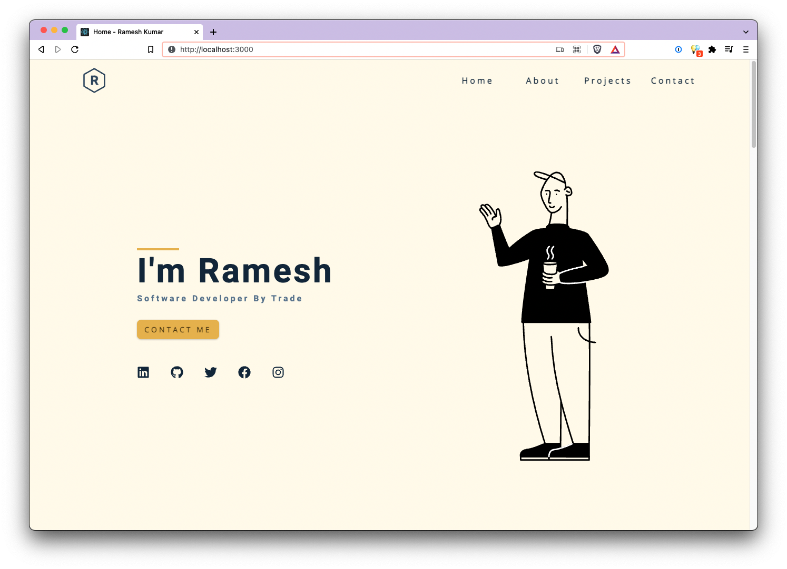

I am a developer by trade with a keen interest in technology. Beside challenging myself, I love learning new
technologies and languages.

You can access my portfolio at: [portfolio](https://rameskum.com)

This is my portfolio website that I've been developing and creating by myself.

## Development

Basic Requisite:

- Node and npm should be installed to build the project.
- I'm using below versions:
  - Node: `v16.13.1`
  - Npm: `7.15.1`

**Customize?**

Install the dependencies:

`npm i`

Run the development server:

`npm run start`

Build the deployable:

`npm run build`

## DEMO

